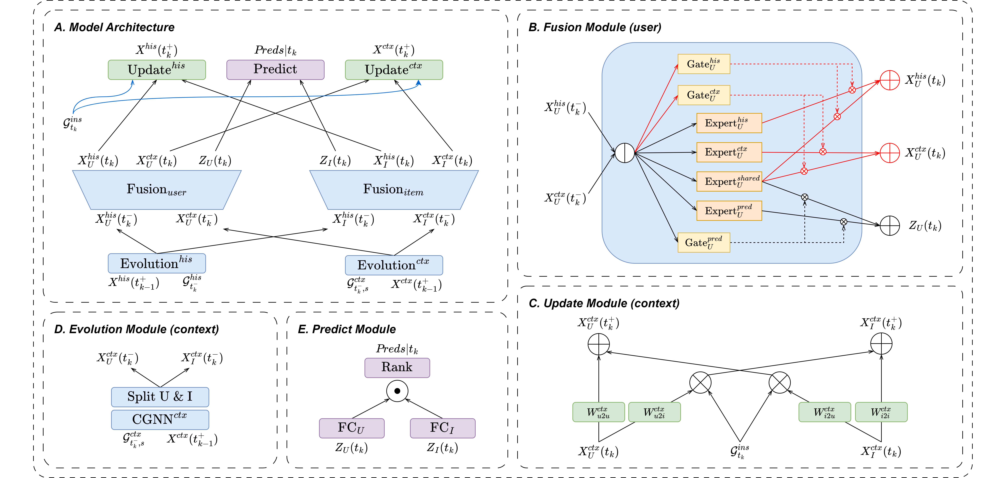

# CPMR
This is the official PyTorch implementation of CPMR from paper 
*"CPMR: Context-Aware Incremental Sequential Recommendation with Pseudo-Multi-Task Learning"* accepted by CIKM'23 (Oral).

## Data
Processed data are stored in `/data/core_5/`. If you wanna process your own data, please put the data under `/data/raw`, 
and check the preprocess scripts `/util/preprocess_raw.py` and `/util/process_data.py`.

## Usage

Please check `demo.sh` on how to run the project.

For more information about CoPE (CIKM'22), please check the official [implementation](https://github.com/FDUDSDE/CoPE) 
and my [implementation](https://github.com/DiMarzioBian/CoPE/) as well.

